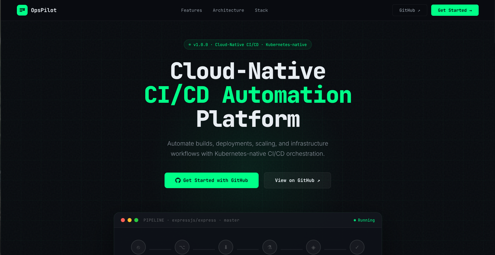
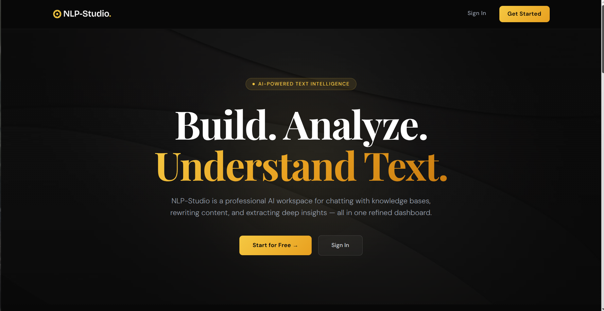

# Abhinav Marlingaplar

---

## Highlights

- Agentic AI Intern @ **Koorier Inc.** - Developing a production-grade multi-agent workflow that automates shipping address validation and correction for a Canadian logistics platform.
- B.Tech CS (AI & Data Science) @ **IIIT Kottayam** · 2023–2027
- Developed production-grade AI systems using RAG, LangGraph, Redis, and vector databases
- Solved **500+ DSA problems** on LeetCode

---

## About

- Computer Science student at IIIT Kottayam focused on building production-grade AI systems, distributed backend services, and cloud-native infrastructure.
- My interests lie at the intersection of agentic AI, RAG architectures, distributed systems, and production backend engineering.
- Currently exploring how AI agents can be integrated into real-world operational workflows while maintaining reliability, observability, and scalability.

---

## Projects

### [Ops Pilot](https://ops-pilot-rho.vercel.app) · Cloud-Native CI/CD Automation Platform

<table>
<tr>
<td width="50%" valign="top">

`React` `Node.js` `RabbitMQ` `Docker` `Kubernetes` `PostgreSQL` `Socket.IO`

A Jenkins/GitHub Actions-inspired CI/CD platform built cloud-native from scratch.

**Key Features**
- Asynchronous pipeline execution through distributed worker pods
- Automated build, test, Docker image generation, and Kubernetes deployment workflows
- GitHub webhook integration for repository-triggered pipelines
- Real-time build monitoring via Socket.IO
- Fault-tolerant job processing with RabbitMQ retry mechanisms

</td>
<td width="50%" valign="top">

</td>
</tr>
</table>

---

### [NLP Studio](https://nlp-studio.vercel.app) · AI-Powered NLP Platform

<table>
<tr>
<td width="50%" valign="top">

`MERN` `Supabase pgvector` `Groq API` `Redis` `JWT` `Vercel` `Render`

A production-grade NLP platform featuring a RAG chatbot, paraphrasing engine, and text analytics suite.

**Key Features**
- RAG pipeline powered by MiniLM (L6 v2) embeddings and pgvector similarity search
- Per-session conversation memory stored in Redis
- JWT authentication with HTTP-only cookies
- Silent token refresh implementation using Axios interceptors

</td>
<td width="50%" valign="top">

</td>
</tr>
</table>

---

## Technical Skills

| Area | Technologies |
|------|-------------|
| **Languages** | C++, Python, JavaScript, SQL |
| **Frontend** | React, HTML, CSS |
| **Backend** | Node.js, Express.js, REST APIs |
| **Databases** | PostgreSQL, MongoDB |
| **Infrastructure** | Docker, Kubernetes, RabbitMQ |
| **Tools** | Git, GitHub, Postman |

---

## Open To

- Software Engineering Internships
- AI/ML Engineering Internships
- Open Source Collaboration
- Full-Stack Development Opportunities

---

"I enjoy building systems that solve real problems — from AI-powered workflows to scalable backend infrastructure."

